\

::: {style="text-align: center; font-weight: bold;"}
 Assembling your replica Weston-Sangamo meter\
      \...in like, 8000 \'simple\' steps.\
\
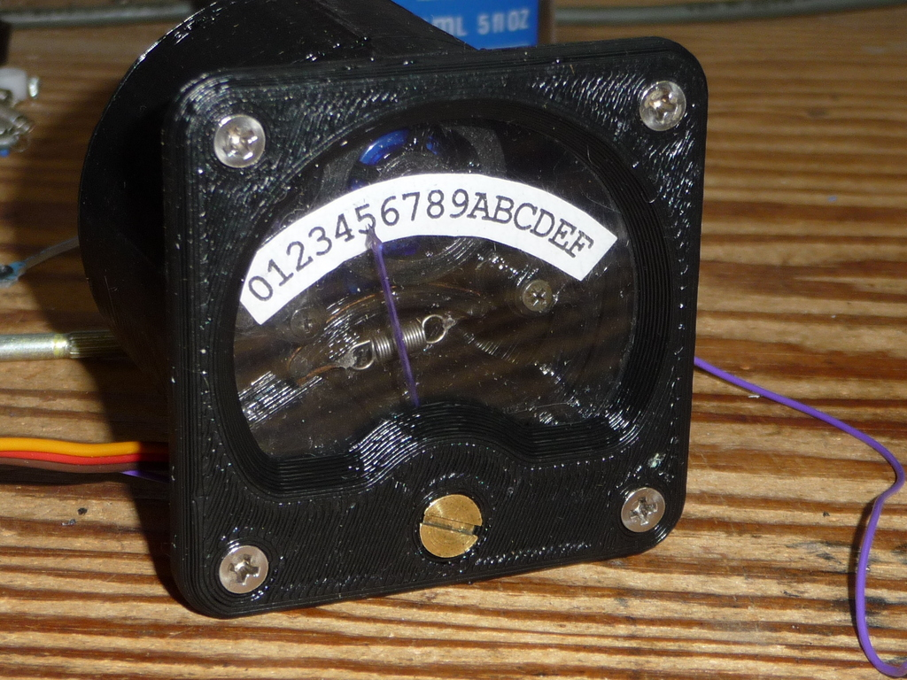\
:::

 By Rue Mohr\
\

------------------------------------------------------------------------

\
o  [Gather the parts:]{style="font-weight: bold;"}\

::: {style="margin-left: 40px;"}
 I have all the files on github at 
https://github.com/ruenahcmohr/oldMeter . If something is missing, find
me and tell me!\
:::

\

::: {style="text-align: center;"}
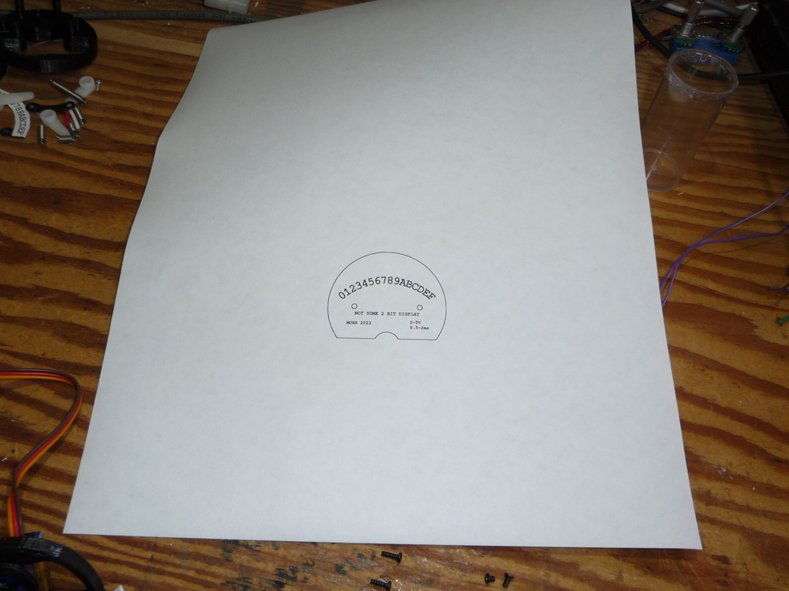\
\
:::

\
[c 3d printed parts:]{style="font-weight: bold;"}\

::: {style="margin-left: 40px;"}
At the time of writing this, there are 12 3d printed parts.\
The back support plate for the needle scale has two options. There is a
normal version, and a steampunk version. The steampunk version is
cooler, so its what I will be using for the tutorial.\
\
:::

::: {style="margin-left: 80px;"}
backface-r2-s.stl(normal version)  or  backfaceB-r1-s.stl (steampunk
version)\
motorFrame-r4-s.stl\
pinsupport-r3-s.stl\
pulley-r6-s.stl\
tube-r2-s.stl\
adapterFlange-r4-s.stl\
potBracket-r2-s.stl\
pulley2-r2-s.stl\
backcap-r3-s.stl\
face-r8-s.stl\
needleHub-r3-s.stl\
trimLock-r1-s.stl\
:::

::: {style="margin-left: 40px;"}
The -r\* is my version number for the part, if you see two of the same
part, use the one with the later version number. These were all just
printed in PLA, no support.\
:::

\
[c CNC cut parts:]{style="font-weight: bold;"}\

::: {style="margin-left: 40px;"}
There are two parts that I made with a CNC machine, if you don\'t have a
cnc machine, (many of us don\'t) please figure something out. I would be
happy to include (most) of the solutions people come up with in the
project as assembly options.\
\
:::

::: {style="margin-left: 80px;"}
pointer-3.nc\
window.nc\
:::

::: {style="margin-left: 40px;"}
The window is cut from the case of a CD with a 3mm carbide bit at about
500RPM. You  should be fine to use a 1.8\" bit.\
\
The pointer was cut from the CD itself (not a rewriteable CD, the stuff
flakes off) with a 1.5mm carbide bit at about 700 RPM\
The needle is trickey to cut. I think its easiest to use double sided
tape to hold it down to something sacraficial. Both the files will do a
moderate overcut of the material.\
The dxf contains the origional profiles if you want to re-cam the
parts.\
:::

\
[c SG90 servo]{style="font-weight: bold;"}\

::: {style="margin-left: 40px;"}
The project uses an SG90 servo, a normal one, not modified for 360
degrees.\
:::

\
[c Sewing pin]{style="font-weight: bold;"}\

::: {style="margin-left: 40px;"}
Because their all the same, right? This kind of thing prevents these
projects from just being \'assemble and play\'.\
:::

\
[c Spring]{style="font-weight: bold;"}\

::: {style="margin-left: 40px;"}
 The spring is out of my bin, I can\'t help you find one (it was the
only one in my bin)\
The spring is about 11.5mm long and has a diameter of about 3.25mm\
:::

::: {style="text-align: center;"}
\
:::

\
[c Thread]{style="font-weight: bold;"}\

::: {style="margin-left: 40px;"}
Any thread should do.\
:::

\
[c Screws]{style="font-weight: bold;"}\

::: {style="margin-left: 40px;"}
Again, most of these screws are from my junk bin. If you have taken
apart an old cell phone, you should have the small ones you need. One of
them is modified.\
I did not include screws here to hold the parts into the main tube body.
If you want to you could either use (9x) M2 machine or plastic screws,
or use \"rivets\" made of 1.75mm filament.\
\
The screw list is:\
:::

::: {style="margin-left: 80px;"}
  4x 4-40 countersunk screws, 1/2\" long, and 4 nuts.\
  6x M2 screws, about 4mm long (here I have used a mix of machine screws
and screws for plastic. I recommend black screws for the face)\
  1x 6-32 brass screw. It does not have to be brass, thats just for
look, But you do need to modify it. Cut it to 24mm long, and file the
end so there is a flat in the middle narrow enough to fit into the slot
of the potentiometer. (Actually you can skip all that if your not going
to add the trim potentiometer)\
:::

\

::: {style="text-align: center;"}
\
:::

\
\
[c Potentiometer.]{style="font-weight: bold;"}\

::: {style="margin-left: 40px;"}
I used a super common potentiometer for the trim adjust on this.
Technically, you might not even need or want a trim for your project.\
The potentiometer is a common RM065 type, I commonly use 10k for things
like this.\
:::

\

::: {style="text-align: center;"}
\
:::

\
[c The scale. ]{style="font-weight: bold;"}\

::: {style="margin-left: 40px;"}
I was not able to get printed stickers in time for this, so I just used
my laser printer for the scale.\
If you open \"scaleArt.svg\" with inkscape, and have it get the size
from the file, it should come out the right size.\
\*\*be aware\*\* that inkscape, by default prints at a HORRIFIC (low)
DPI, make sure that in the options you set it to 600DPI\
:::

\
\

::: {style="text-align: center;"}
\
:::

\
\
[c Crazyglue]{style="font-weight: bold;"}\

::: {style="margin-left: 40px;"}
yup. I just use dollar store stuff cause every a normal bottle is too
expensive and its just going to all sieze up after its opened.\
:::

\
[c Scale glue]{style="font-weight: bold;"}\

::: {style="margin-left: 40px;"}
Some kinda glue for sticking the background print to the plastic
backing, I\'m using some Elmers clear glue. Try to find a glue that will
not warp the paper, I\'m using just a thin layer of the glue I have
here.\
:::

\

------------------------------------------------------------------------

\
\
[o Prep the drive thread.]{style="font-weight: bold;"}\

::: {style="margin-left: 40px;"}
The only way I have to show you the length of this is to use my
calipers. This is about the minimum length you want it to be, It needs
to be rather precise, I think you can get away with it being 2mm shorter
at most. I made this by tieing the string to the end of the spring, and
then giving it a \*tiny\* amount of crazy glue to hold the knot.
(warning, it takes forever to set)\
:::

\

::: {style="text-align: center;"}
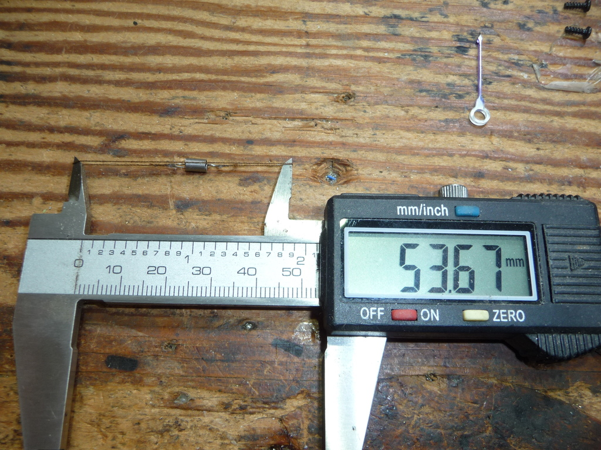\
:::

\
\
[o Prep the background scale]{style="font-weight: bold;"}\

::: {style="margin-left: 40px;"}
If your using the standard scale, cut to the outter lines, then punch
holes were the circles are for screws.\
If you using the steampunk scale, carefully cut around the numbers (or
whatever you modified it to ;\]  )\
:::

\

::: {style="text-align: center;"}
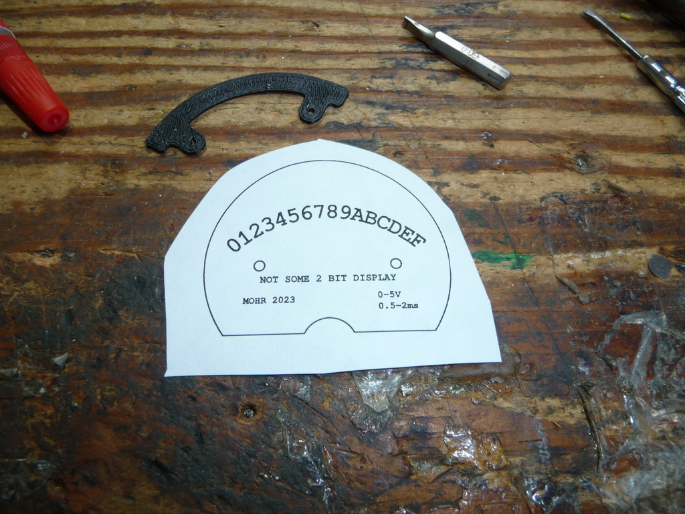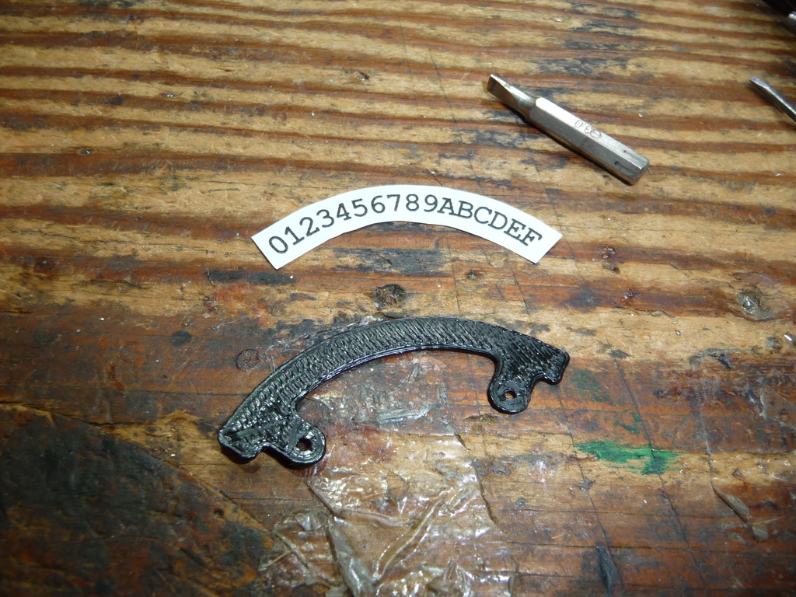\
:::

\
[o Perp needle shaft pin.]{style="font-weight: bold;"}\

::: {style="margin-left: 40px;"}
I cut this pin to about 20.75mm long.\
:::

\

::: {style="text-align: center;"}
\
:::

\
[o Start assembly - mount servo]{style="font-weight: bold;"}\

::: {style="margin-left: 40px;"}
Ok lets start by mouting the servo to \'motorFrame\' Its designed to
just fit the screws that come with the servo.\
:::

\

::: {style="text-align: center;"}
\
:::

\
[o Attach servo pulley]{style="font-weight: bold;"}\

::: {style="margin-left: 40px;"}
The part is just called \'Pulley\' it should friction fit onto the servo
shaft. Its designed to work with the screw that comes with the servo.\
:::

\

::: {style="text-align: center;"}
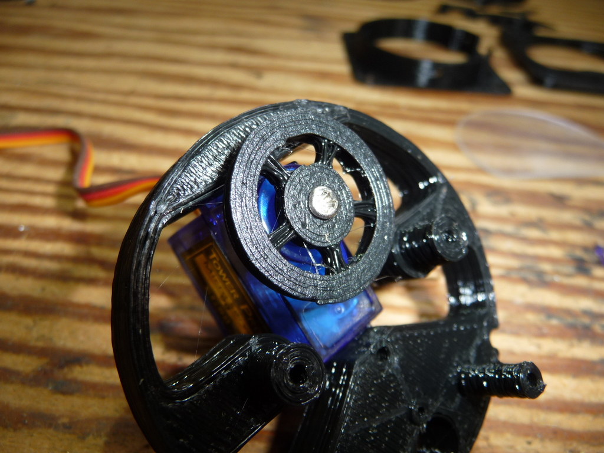\
:::

\
[o Insert the modified pin.]{style="font-weight: bold;"}\

::: {style="margin-left: 40px;"}
If I forgot to go back and tell you what the modification was, I
appologize now.\
This goes in from the servo side of the motorframe, it should be a bit
loose.\
:::

\

::: {style="text-align: center;"}
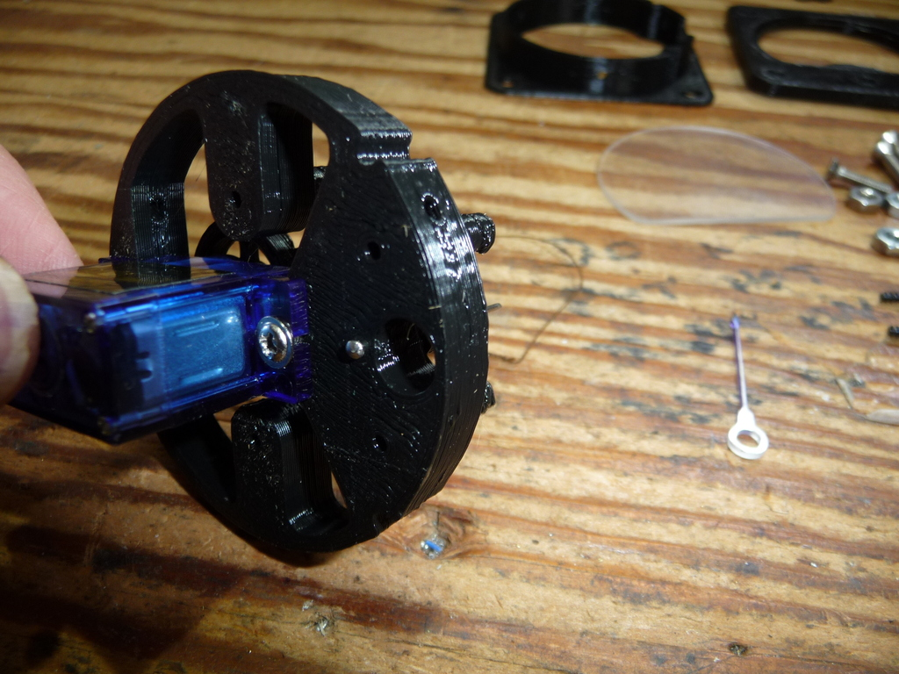\
:::

\
[o Install the motor pulley]{style="font-weight: bold;"}\

::: {style="margin-left: 40px;"}
This is \"Pulley2\" it should be a bit tight on the pin. We will crazy
glue that later.\
:::

\

::: {style="text-align: center;"}
\
:::

\
\
\
[o Install the drive thread.]{style="font-weight: bold;"}\

::: {style="margin-left: 40px;"}
This is an interesting process of getting everything mostly on, then
stretching it the last bit over \"Pulley2\". The spring should sit lower
than the lip on pulley2.\
Try to position the thread so that its against the back of one side of
\"Pulley2\" and the front edge of the opposite side of \"Pulley2\". The
idea is to keep the thread from rubbing on itself where it crosses.\
:::

\

::: {style="text-align: center;"}
\
:::

\
\
[o Install the hub into the needle.]{style="font-weight: bold;"}\

::: {style="margin-left: 40px;"}
The pointer needle was done with a seperate hub to open up the build
options a bit. (For now, its just an annoyance)\
Here I pre-inerted a needle thru the \"NeedleHub\" , then took it off,
and lightly pressed the hub into the cnc cut needle. This also gets
crazy glue to keep it all in place. (later)\
I took this opportunity to use a sharpie to colour my pointer.\
:::

\

::: {style="text-align: center;"}
\
:::

\
\
[o Install the pointer needle on the pin.]{style="font-weight: bold;"}\

::: {style="margin-left: 40px;"}
It should just slide on, you want to have it positioned just a \*bit\*
behind the two adjacent posts.\
:::

\

::: {style="text-align: center;"}
\
:::

\
[o Lock needle in place.]{style="font-weight: bold;"}\

::: {style="margin-left: 40px;"}
Next (lightly!!) crazy glue both \"Pulley2\" and the pointer needle to
the pin. The needle should be aligned to the middle of \"Pulley2\", you
can usually move it a bit later if you want.\
:::

\

::: {style="text-align: center;"}
\
:::

\
\
[o Glue the background scale on.]{style="font-weight: bold;"}\

::: {style="margin-left: 40px;"}
The scale was designed to be used with the standard background
\"Backface\", here, I\'m using the steampunk version \"BackfaceB\"\
:::

\

::: {style="text-align: center;"}
\
:::

\
[o Install front shaft support.]{style="font-weight: bold;"}\

::: {style="margin-left: 40px;"}
While the glue dries a bit from that last step\... This is part
\"Pinsupport\". I used two of the 2mm screws for plastic that I had. The
pin should fit thru loose.\
Please note that the pin should not stick out that much, I cut mine back
after this. The \"Pinsupport\" should not rub the needle hub. I find
that the crazyglue does not stick well to the metal, so if you need to
make adjustments, its usually ok.\
:::

\

::: {style="text-align: center;"}
\
:::

\
[o Install the scale]{style="font-weight: bold;"}\

::: {style="margin-left: 40px;"}
I found that my scale support (\"BackfaceB\") needed the holes a bit
larger for my scerws. I think the model is find and my printer was just
having a bad day. so I enlarged the holes with a small screwdriver. Its
screwed to the two supports with M2 machine screws.\
:::

\

::: {style="text-align: center;"}
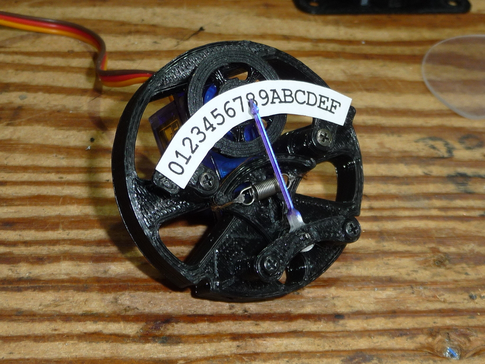\
:::

\
\
[o Install the needle trim potentiometer.]{style="font-weight: bold;"}\

::: {style="margin-left: 40px;"}
This is an electronic trim, its optional. The round edge of
\"PotBracket\" should be on the side of the pot with two pins. I\'m just
using the tap and one end of the potentiometer, you can bring out all 3
leads if you want. The idea is to use this to adjust a small offset in
the needle position to match the printed scale. This is mounted with two
2mm screws for plastic.\
:::

\

::: {style="text-align: center;"}
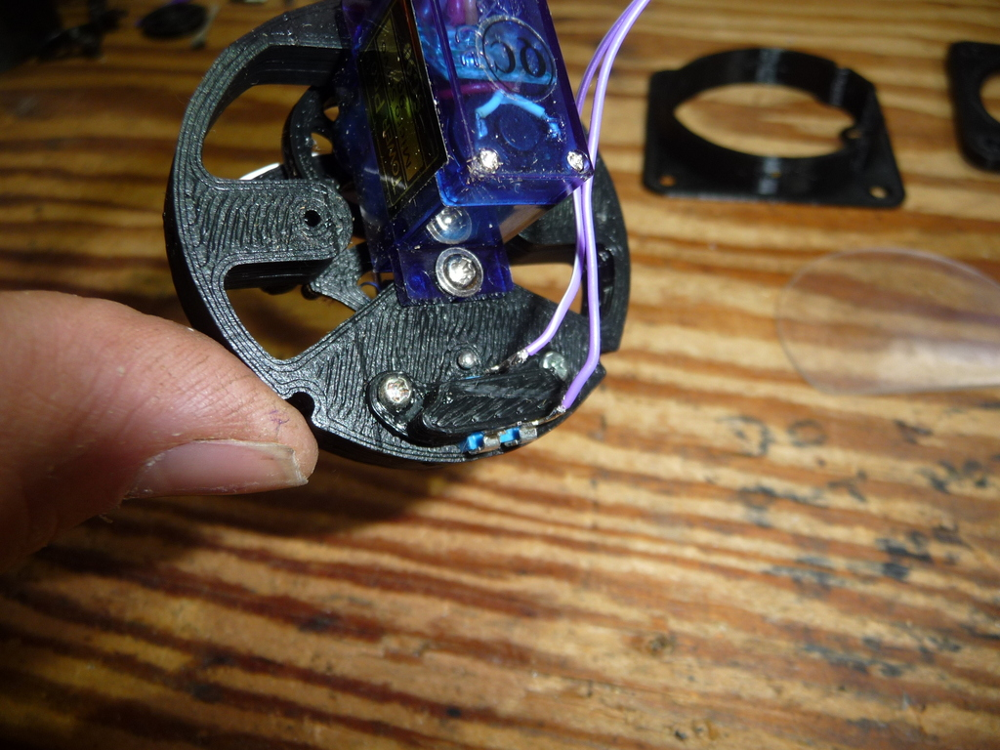\
:::

\
[o Assemble the faceplate.]{style="font-weight: bold;"}\

::: {style="margin-left: 40px;"}
This is parts \"Face\", \"AdapterFlange\" and the CNC cut \"window\".
Its screwed togethor with the 4 countersunk 4-40 screws.\
:::

\

::: {style="text-align: center;"}
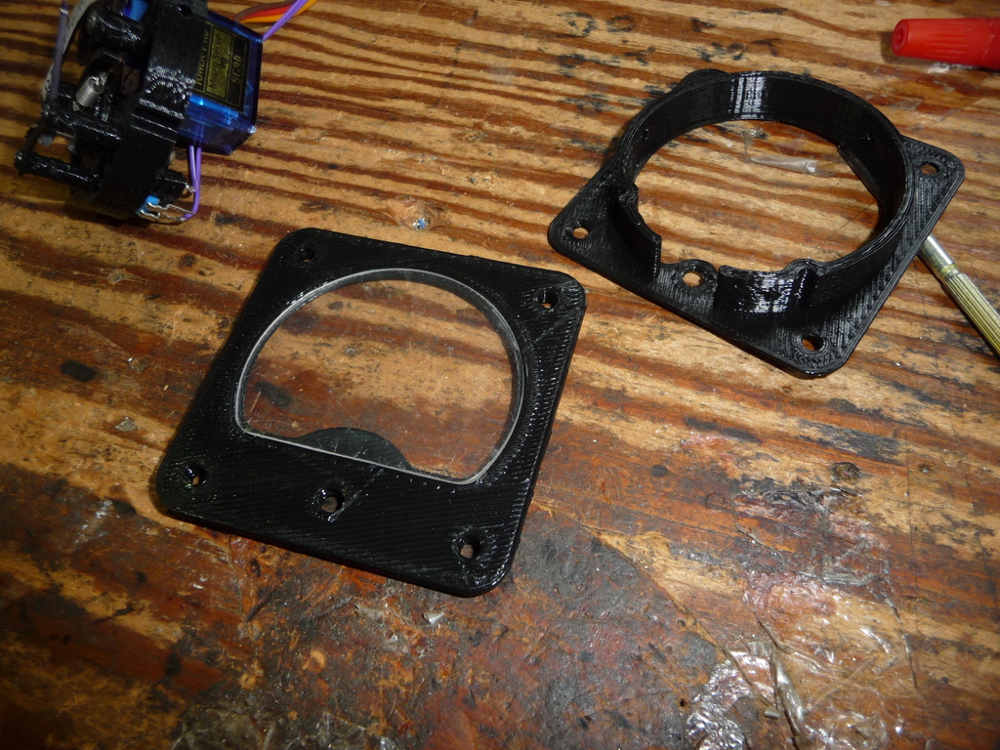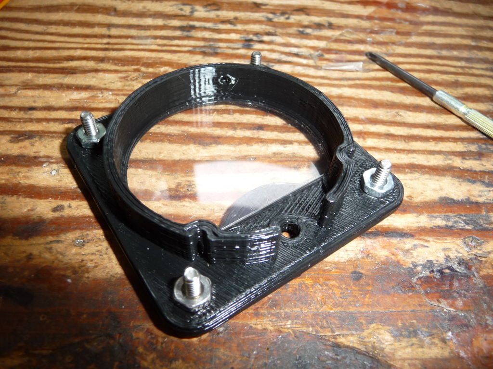\
:::

\
\
[o Install core into the body tube.]{style="font-weight: bold;"}\

::: {style="margin-left: 40px;"}
\*gently\* (The layer ripples dont help, maybe these should be printed
with prime number based layer heights..) slide the motorframe into the
tube. The front of the tube has two close rows of holes on it. Slide it
in until the holes in \"Motorframe\" match the holes in the tube. These
holes were designed to fit 1.75mm filament, As, of yet, I have never
\'permanently\' assembled on of these meters, so if you come up with
something else (2mm screws should work?) do tell me!\
For now, to hold things in place, you can insert some bits of 1.75mm
filament. (try not to loose them in there)\
:::

\

::: {style="text-align: center;"}
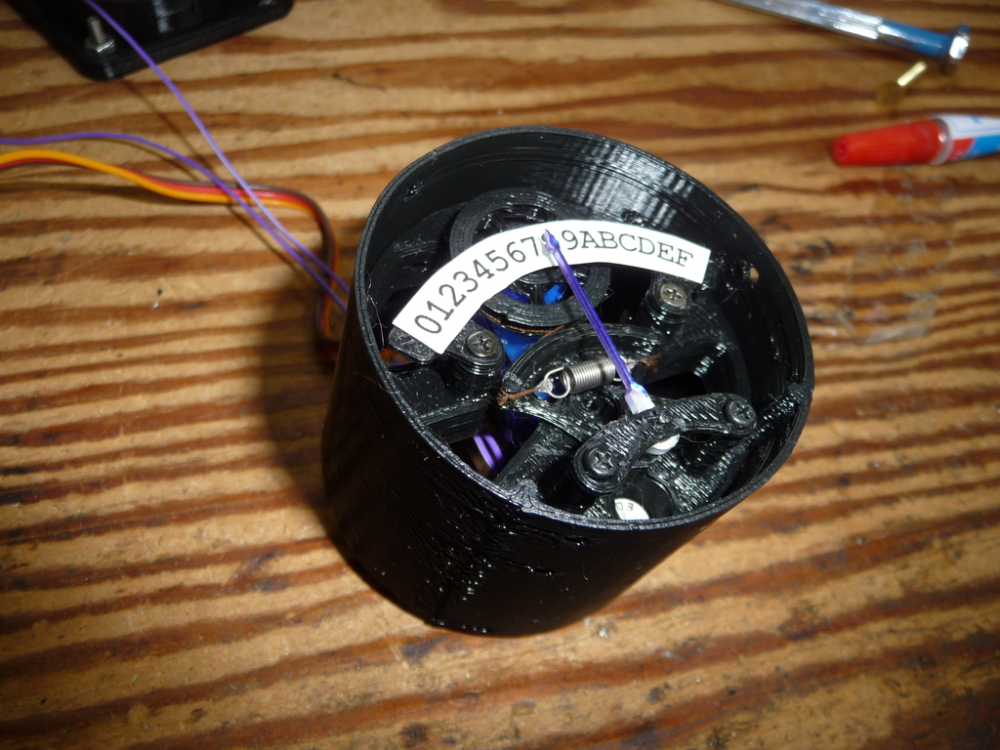\
:::

\
[o Install trim screw.]{style="font-weight: bold;"}\

::: {style="margin-left: 40px;"}
So even if you didn\'t install a potentiometer, you probably want to
have a screw to fill the hole in the face.\
The screw is held in place with \"trimLock\" but its a bit tight. I had
to hold \"TrimLock\" with needle nose pliers and thread the screw into
it. The lock should not be tight, you want to be able to turn the scerw
easily. I put a small dab of glue (not the crazy glue) on there to help
hold it.\
:::

\

::: {style="text-align: center;"}
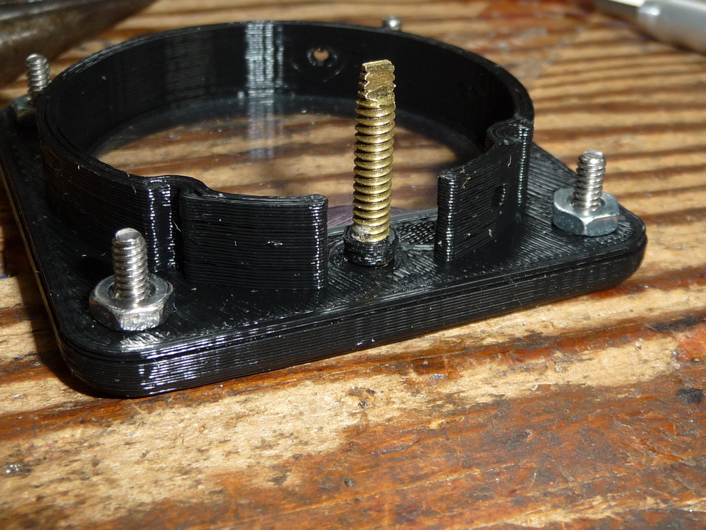\
:::

\
[o Install the face.]{style="font-weight: bold;"}\

::: {style="margin-left: 40px;"}
If you have ever worked on an old meter, you probably know what a pain
trying to align the needle trim system can be like when re-assembling
the meter.\
If you have not, I suppose your about to learn.\
The flat part of the screw should fit into the larger slot of the
potentiometer. Guess the right position, try to assemble it while
wiggling the screw, eventually it should all fit together.\
When its all assembled right, the holes in the side should all line up.\
:::

\

::: {style="text-align: center;"}
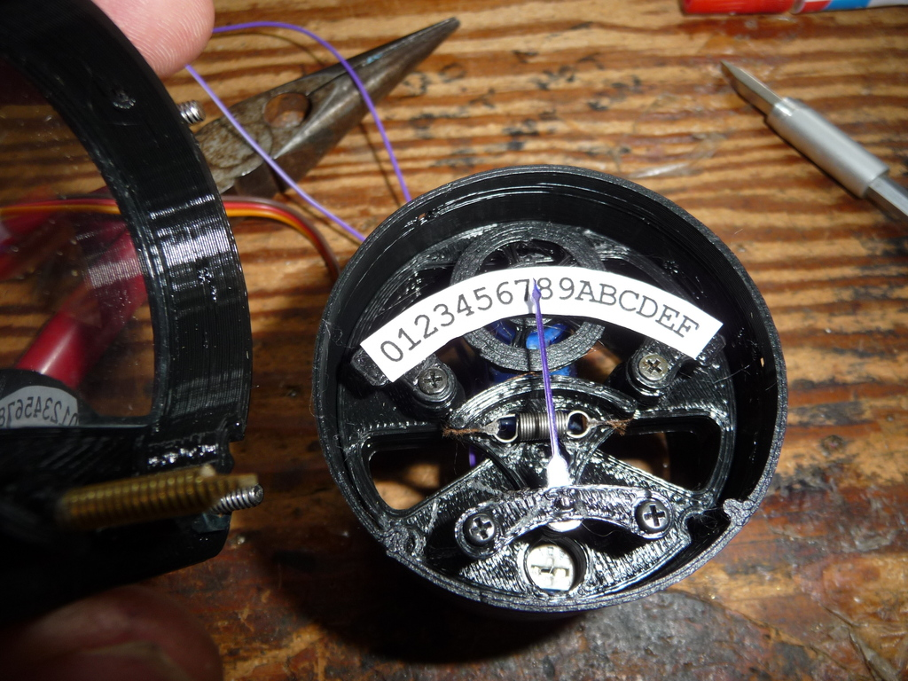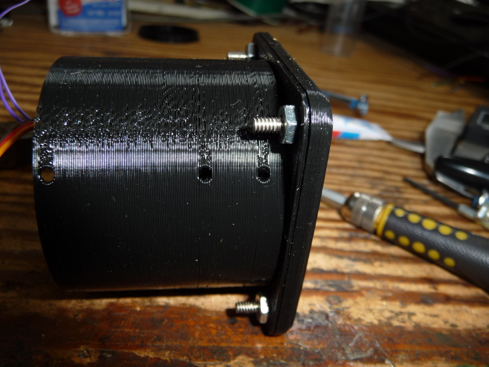\
:::

\
[o Install backplate]{style="font-weight: bold;"}\

::: {style="margin-left: 40px;"}
The last step is to install the backplate, the connector on the servo is
a tight fit, it was meant to fit the servo connector exactly. I\'m just
dumping all the wires thru for now.\
:::

\

::: {style="text-align: center;"}
\
:::

\
\
[o Abrupt tutorial end.]{style="font-weight: bold;"}\

::: {style="margin-left: 40px;"}
This is the part where you need the tutorial to tell you something else,
but the author didn\'t think of it.\
Enjoy, bye!\
:::

\
\
\
\
\
\
\
\
\
\
\
